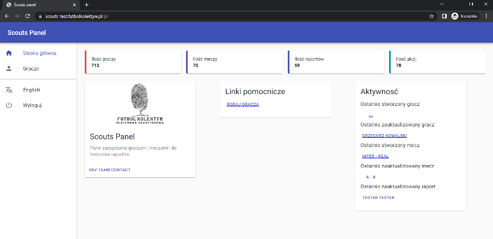
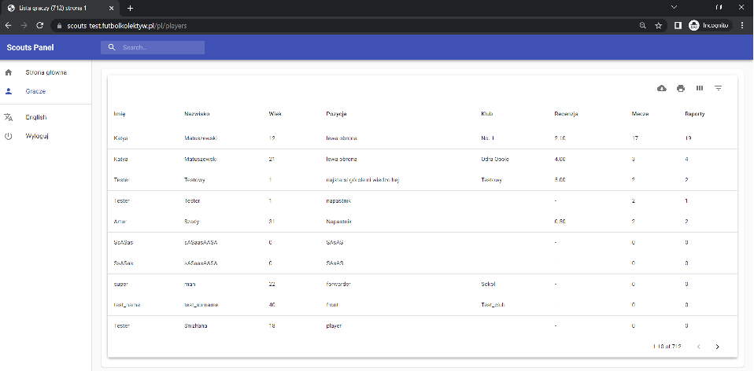
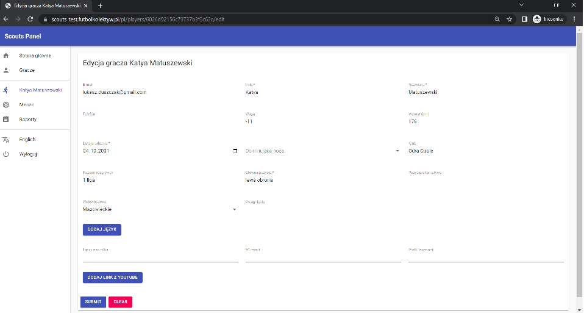
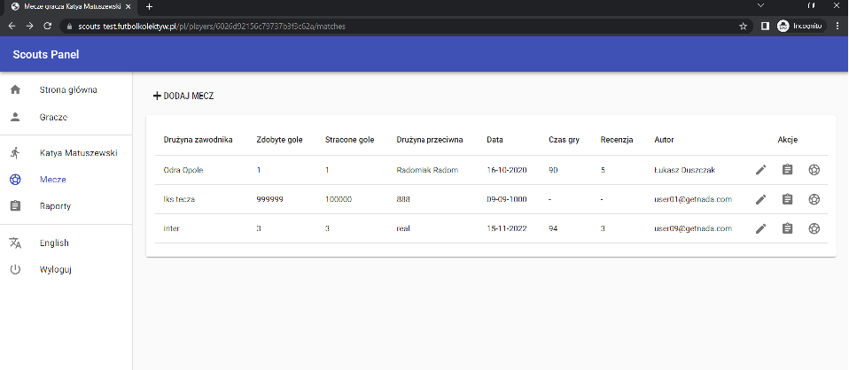
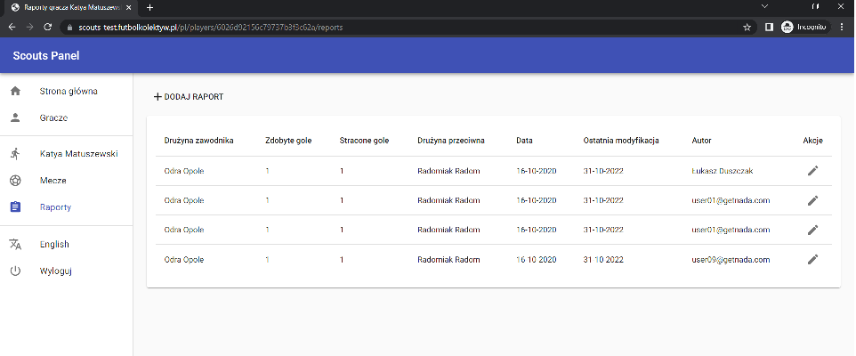

# TASK 1

 :point_right: [Subtask 1](#subtask-1)
 
 :point_right: [Subtask 3](#subtask-3)
 
 :point_right: [Subtask 4](#subtask-4)
 
 :point_right: [Subtask 5](#subtask-5)
 

# TASK 2

 :point_right: [Subtask 1 Pisanie przypadków testowych na podstawie User Story](#subtask-1-pisanie-przypadków-testowych-na-podstawie-user-story)
 
 :point_right: [Subtask 2 Pisanie przypadków testowych na podstawie "własnych doświadczeń"](#subtask-2-pisanie-przypadków-testowych-na-podstawie-własnych-doświadczeń)
 
 :point_right: [Subtask 3 Po co piszemy przypadki testowe?](#subtask-3-po-co-piszemy-przypadki-testowe)
 
 :point_right: [Subtask 4 Pisanie przypadków testowych na podstawie "własnych doświadczeń" w grupie](#subtask-4-pisanie-przypadków-testowych-na-podstawie-własnych-doświadczeń-w-grupie)
 

# TASK 3
 :point_right: [Subtask 1 Creating a form for reporting system bugs](#subtask-1-creating-a-form-for-reporting-system-bugs)
 
 :point_right: [Subtask 2 Testowanie według planów testów i raportowanie błędów](#subtask-2-testowanie-według-planów-testów-i-raportowanie-błędów)
 
 :point_right: [Subtask 3 Raport z wykonanych testów](#subtask-3-raport-z-wykonanych-testów)
 
 :point_right: [Subtask 4 Dla grupy i chętnych. Sesja testów eksploracyjnych](#subtask-4-dla-grupy-i-chętnych-sesja-testów-eksploracyjnych)
 
# TASK 4
 :point_right: [Subtask 1 Utworzenie formatki do zgłaszania błędów](#subtask-1-utworzenie-formatki-do-zgłaszania-błędów)
 
 :point_right: [Subtask 2 Testowanie eksploracyjne i raportowanie błędów](#subtask-2-testowanie-eksploracyjne-i-raportowanie-błędów)
 
 :point_right: [Subtask 3 Do czego służy ta aplikacja?](#subtask-3-do-czego-służy-ta-aplikacja)
 
 :point_right: [Subtask 4 Dla grupy i chętnych. Testy aplikacji mobilnej i webowej](#subtask-4-dla-grupy-i-chętnych-testy-aplikacji-mobilnej-i-webowej)
 
# TASK 5
:point_right: [Sbtask 1 Krótki kurs podstaw SQL](#subtask-1-kótki-urs-odstaw-sql)

:point_right: [Subtask 2 Konfiguracja środowiska i wgranie bazy danych](#subtask-2-konfiguracja-środowiska-i-wgranie-bazy-danych)

:point_right: [Subtask 3 Kilka zadań na rozgrzewkę](#subtask-3-Kilka zadań na rozgrzewkę)

# TASK 1

## Subtask 1
8 pkt :blush:

## Subtask 3
Cześć!!!

Jestem Ania :woman: zdecydowałam się na udział w challengu aby uporządkować dotychczas zdobytą wiedzę i wykorzystać ją w praktycę. 

Myślę, że uczestnictwo w tym projekcie pozwoli mi rozwinąć skrzydła i poznać wiele wspaniałych, ciekawych osób :smiley:.

Moim głownym celem jest, jak najszybsze znalezienie pracy. :computer: :office:

## Subtask 4

### Scouts Panel
:soccer: [Opis aplikacji](#opis-aplikacji)
:soccer: [Lista funkcjonalności](#lista-funkcjonalności)
:soccer: [Ocena interfejsu](#ocena-interfejsu)
:soccer: [Ocena intuicyjności aplikacji](#ocena-intuicyjności)
:soccer: [Zauważone błędy](#zauważone-błędy)

### Opis aplikacji
Aplikacja przeznaczona do zarządzania graczami piłki nożnej :trophy: :soccer: :soccer: :soccer: :trophy:
Pozwala łowcom talentów przeglądać wskaźniki, umiejętności oraz raporty meczowe poszczególnych graczy.

Składa się ze strony głównej https://scouts-test.futbolkolektyw.pl/

Strona graczy `https://scouts-test.futbolkolektyw.pl/players`

Strona konkretnego gracza `https://scouts-test.futbolkolektyw.pl/players/:IdPlayer`

Strona meczów `https://scouts-test.futbolkolektyw.pl/players/:IdPlayer/matches`

Strona raportów `https://scouts-test.futbolkolektyw.pl/players/:IdPlayer/raports`

### Lista funkcjonalności
- Logowanie
- Przypomnienie hasła
- Zmiana języka na Angielski
- Wylogowanie

_**Strona Główna**_

- Wyświetlenie statystyk: liczba graczy, liczba meczy, liczba raportów, liczba akcji.
- Wyświetlenie ostatnich aktywności - tutaj dodałabym ostatnio stworzony raport - wydaje się jakby go brakowało.
- Dodanie gracza - dodałabym przycisk na Stronie gracza, aktualnie tylko z poziomu strony głównej można dodać gracza.
- Wyświetlenie krótkiej informacji o aplikacji, jej Loga oraz link do kontaktu z DEV TEAM

_**Strona Graczy**_

- Wyświetlenie/wygenerowanie tabeli z listą graczy - fajnie gdyby można było ustawić więcej rekordów na stronę np. do wyboru 10/50/100?- teraz jest na sztywno 10 graczy.
- Dawnload CSV - wygenerowanie pliku csv - byłoby fajnie gdyby można było wygenerować listę wszystkich graczy. Na ten moment generuje się tylko dla wyświetlonych na stronie.
- Print - możliwość wydruku tabeli - byłoby fajnie gdyby można było wydrukować listę graczy w wierszach. Przy wydruku następuje formatowanie podobne jak wyświetlenie tabeli na urządzeniu mobilnym.
- View columns - Możliwość wyboru kolumn tabeli: |Imię | Nazwisko| Wiek| Klub | Pozycja | Recenzja | Mecze| Raporty|
- Sortowanie tabeli: | Imię | Nazwisko | Wiek| Klub | Pozycja | Recenzja |
- Filtrowanie tabeli: | Imię | Nazwisko | Wiek min max | Klub | Pozycja | Recenzja min max |
- Reset ustawionych filtrów
- Wyszukiwanie
- Edycja Gracza - naciskając w wybrany wiersz tabeli - bardziej intuicyjne byłoby wprowadzenie przycisku/ikony edycji tak jak jest zrobiona edycja meczu lub raportu.
A naciśnięcie w wybrany wiersz mogłoby powodować przeglądanie karty zawodnika. Dodatkowo wewnątrz można dodać przycisk edytuj.

_**Strona Mecze**_

- Wyświetlenie tabeli meczów wybranego zawodnika
- Dodanie Meczu (poprzez przycisk "DODAJ MECZ")
- Edycja Meczu (poprzez naciśnięcie ikony ołówka w kolumnie Akcje)
- Rozpocznij Mecz (poprzez naciśniecie ikony piłki w kolumnie Akcje)
- Wygeneruj Raport (poprzez naciśnięcie ikony kartki w kolumnie Akcje)

_**Strona Raporty**_

- Wyświetlenie tabeli raportów wybranego zawodnika:
- dodanie raportu (poprez kliknięcie przycisku "DODAJ RAPORT")
- edycja raportu (przycisk ołówka w kolumnie Akcje)

_**Moje propozycje**_:

Do tabeli graczy, meczy i raportów dodadałabym możliwość przeglądania bez wchodzena od razu do edycji. Np. klikając dany wiersza wchodzimy do karty a dopiero tam mamy edycję. Przycisk edycji mógłby być zarówno na liście jak i wewnątrz przegladanego rekordu.

Do kart edycji gracza, meczu, raportu dodałabym przycisk Anuluj.

Nie zauważyłam możliwości usunięcia gracza/meczu/raportu - warto dodać.

Do pól typu nazwa klubu/pozycja/ liga - użyłabym listę do wyboru, aby ograniczyć przypadkowe wpisy.

Do pól typu waga, wzrost, wiek, czas gry, data dodałabym wartości brzegowe.

Do większości pól dodałabym pattern - regularne wyrażenia - (imie, nazwisko, mail, telefon)

Dodałabym krótką instrukcję jak obsługiwać funkcjonalność "rozpocznij mecz" zauważyłam że w zależności co tam ustawimy pojawia się lista zdażeń podpięta pod konkretny mecz. Jest to chyba najmniej intuicyjna funkcjonalność.

Wprowadziłabym:
  uprawnienia na zasadzie, że zalogowany użytkownik może usuwać i edytować tylko graczy, których sam dodał (jest autorem), pozostałych może tylko przeglądać,
  weryfikację aby system nie pozwalał duplikować graczy.

Dodałabym możliwość porównania zawodników.
Zastanawiam się, czy dobrze jest, że raporty i mecze są dostępne dopiero po wejściu w konkretnego zawodnika. 

Jeżeli aplikacja jest przeznaczona dla łowców talentów pole "recenzja zawodnika" oznaczyłabym jako wymagana, a najważniejsze wskaźniki opisujące zawodnika dodałabym do karty zawodnika tak, aby łatwo i szybko umożliwić wytypowanie/wyszukanie najlepszych graczy. 

### Ocena interfejsu
Aplikacja wygląda na niedokończoną. Logo nie kojarzy się z tematyką aplikacji. Brakuje szaty graficznej, która nawiązywała by do piłki nożnej i zawodników.
Szczególnie Strona główna prezentuje się ubogo. Zbyt dużo wolnego miejsca między wyświetlonymi kartami. Za mało informacji do czego służy aplikacja. Plus za prostą formę. Układ kart lepiej prezentuje się na wyświetlaczu urządzenia mobilnego niż na laptopie.

### Ocena intuicyjności
Intuicyjność na średnim poziomie. pewnych działań trzeba się domyśleć, nie są oczywiste, a czasami wręcz przypadkowe. 

Najtrudniejsza i nadal niezrozumiała jest dla mnie część "rozpocznij mecz" nie wiem jak należy ją wykorzystywać. :confused:

Dla mnie jako osoby bez wiedzy dziedzinowej aplikacja jest dosyć trudna w obsłudzę. Uważam, że przeglądanie graczy jest mało przyjemne. 

Jeśli aplikacja została przygotowana z myślą o łowcach talentów, powinna w łatwy sposób umożliwiać dostęp do najważniejszych wskaźników. Wydaje się uzasadnionym wymaganie najważniejszych infromacji: Recenzja, pozycja, ile meczy zawodnik rozegrał, jak długo był na boisku, jaką ma skuteczność, jak często otrzymuje żółte, czerwone kartki itp. 

### Zauważone błędy
Strona główna:
-karta aktywności - jest literówka i wydaje się, że brakuje linka do ostatnio utworzonego raportu.

Strona gracze
- brak przycisku "+DODAJ GRACZA",
- po wprowadzeniu filtra naciskając "reset" resetuje tylko wpisane filtry, tabela nie zostaje odświeżona,
- po zmianie języka na polski w filtrach opis pola "wiek" i "recenzja" jest nadal po angielsku,

Edycja gracza
- pole "waga" i "wzrost" przyjmują wartości ujemne, 0, oraz bardzo wysyku - nierealne - brakuje wartości brzegowych,
- pole "imię" i "nazwisko" przyjmuje cyfry i znaki specjalne, wewnątrz można adodawać duże litery,
- data urodzenia - można wpisać rok 0001 lub aktualną i przyszłą datę co powoduje że zawodnik może mieć ponad 2000 lub 0 lat WOW  :astonished:
- szkoda że po błędnym wpisaniu maila i opuszczeniu kursorem pola nie pojawia się notyfikacja z prośbą o poprawne wpisanie maila. Otrzymujemy informację że akcja się nie powiodła. Z serwera otrzymujemy odpowiedź o błędnym zapytaniu i status kod 400 z wiadomością validationError,
- po zmianie na język angielski opis pola łączy nas piłka i 90 minut pozostaje po polsku,
- po zmianie Imienia lub nazwiska i zapisaniu zmian po lewej stronie w menu imię i nazwisko nie odświeżają się automatycznie tylko dopiero po kliknięciu w te dane,

Edycja meczu
- po zmianie na język polski - opis pola "web match" i "general" pozostaje po angielsku
- pole "data gry" przyjmuje podobnie jak data urodzin nierealne roczniki - brakuje wartości brzegowych,
- pole "czas gry" przyjmuje wartości ujemne oraz bardzo duże - należałoby ograniczyć je do 90 min + dodatkowe minuty związane z karnymi lub przedłużeniem meczu przez sędziego,
- pole "drużyna przeciwnika" oraz "drużyna zawodnika", "kolor koszulki", "liga" przyjmują znaki specjalne, cyfry  - należaloby wprowadzić ograniczenia, pattern lub wybór z listy,
- pole nr - przyjmuje wartości ujemne i bardzo duże liczby - należałoby wprowadzić wartości brzegowe.

Strona raportów
- klikając przycisk "+DODAJ RAPORT" zostajemy przeniesieni do "strony MECZÓW" `https://scouts-test.futbolkolektyw.pl/pl/players/{IdPlayer}/matches` - nie otwiera się formularz raportu,
- aby przeglądać raport musimy wejść w przycisk edycji,
- edytując raport nie ma możliwiści anulowania,
- edytując raport klikając w link www.futbolkolektyw.pl otrzymujemy status code 404 Page Not found,

Podczas edycji GRACZA/MECZU przycisk CLEAR czyści tylko nowo dodane pola. 

## Subtask 5

:heavy_check_mark: założenie projektu

:heavy_check_mark: zaproszenie członków zespołu

# TASK 2

## Subtask 1 Pisanie przypadków testowych na podstawie User Story  
  Used aplication https://scouts-test.futbolkolektyw.pl/
  #### Below link to my work
  [:link: Subtask 1 Test Cases](https://docs.google.com/document/d/12IQTMrLlmiYL3-2tv45tQ4LixHK77mXL/edit?usp=sharing&ouid=103746433813255072256&rtpof=true&sd=true)

## Subtask 2 Pisanie przypadków testowych na podstawie "własnych doświadczeń"
  Used aplication https://scouts-test.futbolkolektyw.pl/
  #### Below link to my work
  [:link: Subtask 2 Test Cases](https://docs.google.com/document/d/1QFMPe0oa-9lypDsWDupMizY6hNGDJSIN/edit?usp=sharing&ouid=103746433813255072256&rtpof=true&sd=true)

## Subtask 3 Po co piszemy przypadki testowe?
  :exclamation: Przypadki testowe przygotowujemy w celu sprawdzenia prawidłowego działania funkcjonalności oprogramowania. 

  :exclamation: Tworzymy je aby udokumentować możliwość obsłużenia poszczególnych modułów , z których składa się aplikacja.

  :exclamation: Odpowiednie pokrycie przypadkami testowymi oprogramowania daje nam pewność, że nie pomineliśmy żadnej ważnej punkcjonalności.

  :exclamation: Mogą być podstawą do przygotowania raportów z wykonanych testów.

  :exclamation: Dla nowych pracowników mogą być cennym źródłem informacji na temat oprogramowania.

  :exclamation: Można je wykorzystać w testach akceptacyjnych w celu sprawdzenia czy oprogramowanie spełnia oczekiwania i wymagania klienta.

  :exclamation: Odpowiednio przygotowane i utrzymane pozwolą na ich ponowne wykorzystanie.

## Subtask 4 Pisanie przypadków testowych na podstawie “własnych doświadczeń" w grupie
  Used aplication Pick Eat Up
  #### Below link to my work
  [:link: Subtask 4 pickeatup_TC](https://docs.google.com/document/d/10ITHeYiyAGZT9PxhHSUMOt0QOAbAxj6x/edit?usp=sharing&ouid=103746433813255072256&rtpof=true&sd=true)

# TASK 3

Zadanie wykonałam w 1 pliku w oddzielnych arkuszach.

## Subtask 1 Creating a form for reporting system bugs

:heavy_check_mark: wykonane

#### Below link to my work
[:link: Form for reporting bugs](https://docs.google.com/spreadsheets/d/16WHc_jIXuIU_GSwJQ92fDu0YHpByebRL-rqnq_NGHCQ/edit?usp=sharing)

## Subtask 2 Testowanie według planów testów i raportowanie błędów 

:heavy_check_mark: wykonane

#### Below link to my work
[:link: Test Cases with bugs reports](https://docs.google.com/spreadsheets/d/1kkoFV9JfoCTPTZBvWDkPWeZYtGc6hH42n3EWQscOmbI/edit?usp=sharing)

## Subtask 3 Raport z wykonanych testów

:heavy_check_mark: wykonane

#### Below link to my work
[:link: Test Cases with bugs reports](https://docs.google.com/spreadsheets/d/1kkoFV9JfoCTPTZBvWDkPWeZYtGc6hH42n3EWQscOmbI/edit?usp=sharing)

## Subtask 4 Dla grupy i chętnych. Sesja testów eksploracyjnych

:x:

#### Below link to my work

[:link: Test Cases with bugs reports]()

# TASK 4

## Subtask 1 Utworzenie formatki do zgłaszania błędów

:heavy_check_mark: done

#### Below link to my work
[:link: Form for reporting bugs](https://docs.google.com/spreadsheets/d/18r_vD8xQHRbiuMH_4FHGTPJGYh4w_oc8NhGwj26GJtA/edit?usp=sharing)

## Subtask 2 Testowanie eksploracyjne i raportowanie błędów

:heavy_check_mark: done

#### Below link to my work
[:link: Report of bugs](https://docs.google.com/spreadsheets/d/1_qmMgbVXrp-howRCGKj6EW0n3Ya0Fw5SR-VVO0kvsIM/edit?usp=sharing)

## Subtask 3 Do czego służy ta aplikacja?

Obraz autorstwa <a href="https://pl.freepik.com/darmowe-wektory/plaska-osoba-medytujaca-spokojnie_13404871.htm">Freepik</a>

:thinking: [Do czego służy ta aplikacja? Jaki jest cel tej aplikacji?](#do-czego-służy-ta-aplikacja-jaki-jest-cel-tej-aplikacji)

:thinking:[Kto ma być użytkownikiem końcowym aplikacji?](#kto-ma-być-użytkownikiem-końcowym-aplikacji)

:thinking: [Czy według Ciebie aplikacja jest user friendly?](#czy-według-ciebie-aplikacja-jest-user-friendly)

:wrench: [Jak usprawnić aplikację?](#jak-usprawnić-aplikację)

:interrobang: [Jakie dostrzegasz różnice pomiędzy testowaniem aplikacji internetowej, a natywnej?](#jakie-dostrzegasz-różnice-pomiędzy-testowaniem-aplikacji-internetowej-a-natywnej)

### Do czego służy ta aplikacja? Jaki jest cel tej aplikacji?

<a href="https://pl.freepik.com/darmowe-wektory/biznesmen-dokonac-sukces-w-biznesie-wzrostu-pieniedzy-inwestycje-finansowe-i-zwrot-z-inwestycji-koncepcja-roi-inwestycje-finansowe-marketing-analizy-zabezpieczenia-depozytow-ilustracji-wektorowych_21586033.htm#query=make%20money&position=2&from_view=search&track=sph">Obraz autorstwa jcomp</a> na Freepik

Sama nazwa **FOCUSLY** sugeruje koncentrację i skupienie. I okazuje się, że ma to sens :slightly_smiling_face: 
W aplikacji znajdziemy ogrom wiedzy związanej z:
- medytacją :lotus_position: :lotus_position: :lotus_position:, 
- techniką mindfulnes, 
- ćwiczenia oddechowe, 
- muzykę relaksacyjną.

Myślę, że aplikacja umożliwia naukę medytacji, uważności, koncentracji, radzenia sobie ze stresem.

Pozwala odkryć i zwiększyć świadomość swoich uczuć i emocji.

Umożliwia wprowadzenie się w stan relaksu i wyciszenia. 

Biorąc pod uwagę, że istnieje możliwość zakupu subskrypcji uważam, że nadrzędnym celem jest generowanie zysku :money_mouth_face::money_mouth_face::money_mouth_face:.

### Kto ma być użytkownikiem końcowym aplikacji?
Aplikacja skierowana do osób zainteresowanych rozwojem duchowym, a także dla tych, którzy chcą lepiej radzić sobie: ze stresem, emocjami, problemami ze snem, z koncentracją itp.

### Czy według Ciebie aplikacja jest user friendly?
Aplikacja jest dość intuicyjna i przyjemna w obsłudze. 

### Jak usprawnić aplikację? 

:wrench: Do muzyki dodałabym przyciski poprzedni następny utwór, oraz opcje puszczania utworów w pętli. 

:wrench: Opcja dopasowania materiałów do konkretnej osoby "Dla ciebie" należałoby dopracować. Tak aby wybierając Rozwój osobisty nie otrzymywać informacji np. "zdrowie psyhiczne w połogu" hmm trochę się zdziwiłam :scream_cat: Dlatego do opcji "Dla ciebie" w ankiecie w 2 pytaniu dodałabym jeszcze opcję związaną z byciem mamą tak aby materiały związane z ciążą/dziećmi itd. były dobrze proponowane. 

:wrench: W wyzwaniach możliwość uczestniczenia w wiecej niż jednym wyzwaniu.

:wrench: W miejscach gdzie zaimplementowany został przycisk play nad listą utworów należy go naprawić albo usunąć (lepiej żeby go nie było niż ma być niedziałający).

:wrench: Ćwiczenia oddechowe bardzo mi się spodobały troszkę bym skróciła czas nabierania i zatrzymywania powietrza bo nawet na najniższym poziomie miałam problem :woozy_face:  :stuck_out_tongue_winking_eye: chyba że potrzebuje treningu :stuck_out_tongue_winking_eye: :muscle:

:wrench: Zmieniłabym na stronie "Odkrywaj" sposób przewijania kategori - nie podoba mi się aktualny. Osobiście wolałabym przewijając w danym momencie widzieć w 2 rzędach po 1 na rząd tak aby nie przycinały się z powodu braku miejsca na ekranie. 

### Jakie dostrzegasz różnice pomiędzy testowaniem aplikacji internetowej, a natywnej?

Moim zdaniem testowanie aplikacji mobilnych jest bardziej wymagające należy wziąć pod uwagę wiele rodzajów telefonów, wielkości ekranów oraz systemów operacyjnych, które częściej się zmieniają.

## Subtask 4 Dla grupy i chętnych. Testy aplikacji mobilnej i webowej

:heavy_check_mark: done

#Task 5

## Sbtask 1 Krótki kurs podstaw SQL

:heavy_check_mark: done

## Subtask 2 Konfiguracja środowiska i wgranie bazy danych

:heavy_check_mark: done

## Subtask 3 Kilka zadań na rozgrzewkę

1. Wyświetl tabelę actors w kolejności alfabetycznej sortując po kolumnie surname.
`SELECT * FROM actors ORDER BY surname;`

2. Wyświetl film, który powstał w 2019 roku.

3. Wyświetl wszystkie filmy, które powstały między 1900, a 1999 rokiem.

4. Wyświetl JEDYNIE tytuł i cenę filmów, które kosztują poniżej 7$ 

5. Użyj operatora logicznego AND, aby wyświetlić aktorów o actor_id pomiędzy 4-7 (4 i 7 powinny się wyświetlać). NIE UŻYWAJ operatora BETWEEN.

6. Wyświetl klientów o id 2,4,6 wykorzystaj do tego warunek logiczny. 

7. Wyświetl klientów o id 1,3,5 wykorzystaj do tego operator IN. 

8. Wyświetl dane wszystkich osób z tabeli ‘actors’, których imię zaczyna się od ciągu “An”.

9. Wyświetl dane klienta, który nie ma podanego adresu email.

10. Wyświetl wszystkie filmy, których cena wynosi powyżej 9$ oraz ich ID mieści się pomiędzy 2 i 8 movie_id.
